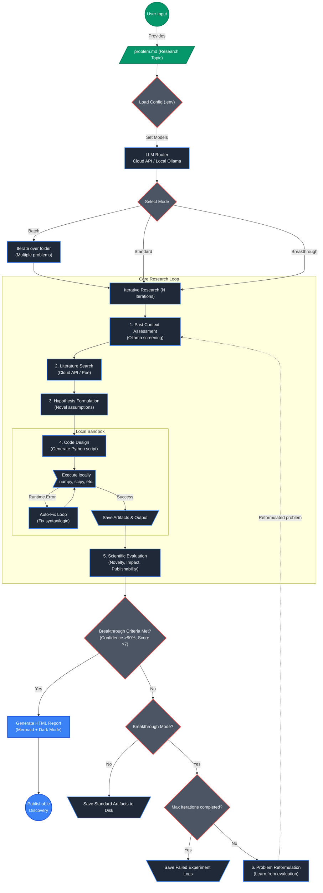

```mermaid
graph TD
    %% Styling
    classDef default fill:#1f2937,stroke:#3b82f6,stroke-width:2px,color:#f9fafb
    classDef highlight fill:#3b82f6,stroke:#1d4ed8,stroke-width:2px,color:#ffffff
    classDef decision fill:#4b5563,stroke:#ef4444,stroke-width:2px,color:#f9fafb
    classDef input fill:#059669,stroke:#047857,stroke-width:2px,color:#ffffff

    %% User Input
    User((User Input)):::input -->|Provides| Problems[/"problem.md (Research Topic)"/]:::input
    
    %% Architecture & Routing
    Problems --> Config{"Load Config (.env)"}:::decision
    Config --> |Set Models| Router[LLM Router<br/>Cloud API / Local Ollama]
    
    Router --> Mode{Select Mode}:::decision
    Mode -->|Batch| BatchLoop["Iterate over folder<br/>(Multiple problems)"]
    BatchLoop --> Cycle
    Mode -->|Standard| Cycle["Single Pass"]
    Mode -->|Breakthrough| Cycle["Iterative Research (N iterations)"]

    %% Core Research Cycle
    subgraph ResearchCore [Core Research Loop]
        direction TB
        
        Cycle --> ContextScreen["1. Past Context Assessment<br/>(Ollama screening)"]
        ContextScreen --> WebSearch["2. Literature Search<br/>(Cloud API / Poe)"]
        WebSearch --> Hypothesize["3. Hypothesis Formulation<br/>(Novel assumptions)"]
        Hypothesize --> CodeGen["4. Code Design<br/>(Generate Python script)"]
        
        %% Execution Loop
        subgraph LocalExecution [Local Sandbox]
            CodeGen --> RunCode>Execute locally<br/>numpy, scipy, etc.]
            RunCode -->|Runtime Error| AutoFix["Auto-Fix Loop<br/>(Fix syntax/logic)"]
            AutoFix --> RunCode
            RunCode -->|Success| ResultsLog[\Save Artifacts & Output/]
        end
        
        ResultsLog --> Eval["5. Scientific Evaluation<br/>(Novelty, Impact, Publishability)"]
    end

    %% Evaluation & Control Flow
    Eval --> IsBreakthrough{"Breakthrough Criteria Met?<br/>(Confidence >90%, Score >7)"}:::decision
    
    %% Outcomes
    IsBreakthrough -->|Yes| MakeReport["Generate HTML Report<br/>(Mermaid + Dark Mode)"]:::highlight
    MakeReport --> Success((Publishable<br/>Discovery)):::highlight
    
    IsBreakthrough -->|No| CheckMode{"Breakthrough Mode?"}:::decision
    
    CheckMode -->|No| SaveStandard[\Save Standard Artifacts to Disk/]
    
    CheckMode -->|Yes| CheckIters{"Max Iterations completed?"}:::decision
    CheckIters -->|Yes| SaveFailed[\Save Failed Experiment Logs/]
    
    CheckIters -->|No| Reformulate["6. Problem Reformulation<br/>(Learn from evaluation)"]
    Reformulate -.->|Reformulated problem| ContextScreen
```
